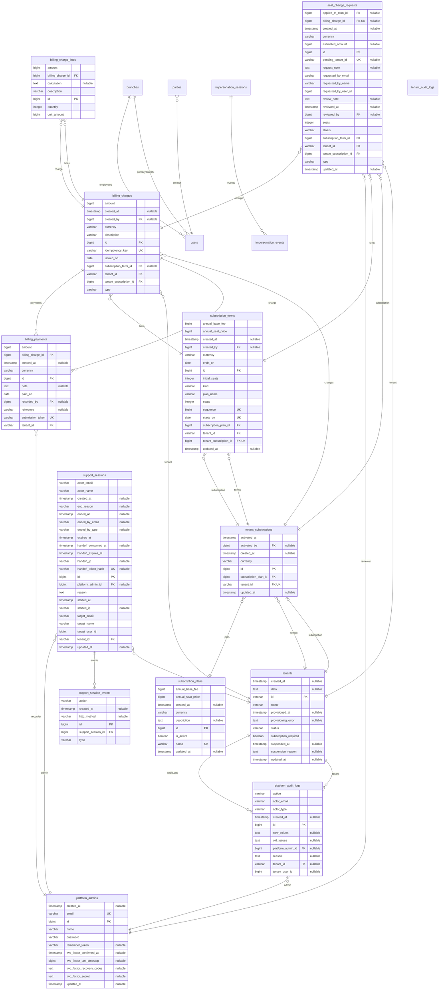

<!-- Generated by byrcsc/laravel-cartographer. -->

```mermaid
erDiagram
    billing_charge_lines }o--|| billing_charges : "charge"
    billing_charges ||--o{ billing_charge_lines : "lines"
    billing_charges ||--o{ billing_payments : "payments"
    billing_charges }o--|| subscription_terms : "term"
    billing_charges }o--|| tenants : "tenant"
    billing_payments }o--|| billing_charges : "charge"
    billing_payments }o--|| platform_admins : "recorder"
    branches ||--o{ users : "employees"
    impersonation_sessions ||--o{ impersonation_events : "events"
    parties }o--|| users : "creator"
    platform_audit_logs }o--|| platform_admins : "admin"
    platform_audit_logs }o--|| tenants : "tenant"
    seat_change_requests }o--|| billing_charges : "charge"
    seat_change_requests }o--|| platform_admins : "reviewer"
    seat_change_requests }o--|| subscription_terms : "term"
    seat_change_requests }o--|| tenant_subscriptions : "subscription"
    seat_change_requests }o--|| tenants : "tenant"
    subscription_terms }o--|| tenant_subscriptions : "subscription"
    support_sessions }o--|| platform_admins : "admin"
    support_sessions ||--o{ support_session_events : "events"
    support_sessions }o--|| tenants : "tenant"
    tenant_subscriptions ||--o{ billing_charges : "charges"
    tenant_subscriptions }o--|| subscription_plans : "plan"
    tenant_subscriptions ||--o{ subscription_terms : "terms"
    tenant_subscriptions }o--|| tenants : "tenant"
    tenants ||--o{ platform_audit_logs : "auditLogs"
    tenants ||--o| tenant_subscriptions : "subscription"
    users }o--|| branches : "primaryBranch"

    billing_charge_lines {
        bigint amount
        bigint billing_charge_id FK
        text calculation "nullable"
        varchar description
        bigint id PK
        integer quantity
        bigint unit_amount
    }
    billing_charges {
        bigint amount
        timestamp created_at "nullable"
        bigint created_by FK "nullable"
        varchar currency
        varchar description
        bigint id PK
        varchar idempotency_key UK
        date issued_on
        bigint subscription_term_id FK "nullable"
        varchar tenant_id FK
        bigint tenant_subscription_id FK
        varchar type
    }
    billing_payments {
        bigint amount
        bigint billing_charge_id FK
        timestamp created_at "nullable"
        varchar currency
        bigint id PK
        text note "nullable"
        date paid_on
        bigint recorded_by FK "nullable"
        varchar reference "nullable"
        varchar submission_token UK
        varchar tenant_id FK
    }
    branches
    impersonation_events
    impersonation_sessions
    parties
    platform_admins {
        timestamp created_at "nullable"
        varchar email UK
        bigint id PK
        varchar name
        varchar password
        varchar remember_token "nullable"
        timestamp two_factor_confirmed_at "nullable"
        bigint two_factor_last_timestep "nullable"
        text two_factor_recovery_codes "nullable"
        text two_factor_secret "nullable"
        timestamp updated_at "nullable"
    }
    platform_audit_logs {
        varchar action
        varchar actor_email
        varchar actor_type
        timestamp created_at "nullable"
        bigint id PK
        text new_values "nullable"
        text old_values "nullable"
        bigint platform_admin_id FK "nullable"
        text reason "nullable"
        varchar tenant_id FK "nullable"
        bigint tenant_user_id "nullable"
    }
    seat_change_requests {
        bigint applied_to_term_id FK "nullable"
        bigint billing_charge_id FK, UK "nullable"
        timestamp created_at "nullable"
        varchar currency
        bigint estimated_amount "nullable"
        bigint id PK
        varchar pending_tenant_id UK "nullable"
        text request_note "nullable"
        varchar requested_by_email
        varchar requested_by_name
        bigint requested_by_user_id
        text review_note "nullable"
        timestamp reviewed_at "nullable"
        bigint reviewed_by FK "nullable"
        integer seats
        varchar status
        bigint subscription_term_id FK
        varchar tenant_id FK
        bigint tenant_subscription_id FK
        varchar type
        timestamp updated_at "nullable"
    }
    subscription_plans {
        bigint annual_base_fee
        bigint annual_seat_price
        timestamp created_at "nullable"
        varchar currency
        text description "nullable"
        bigint id PK
        boolean is_active
        varchar name UK
        timestamp updated_at "nullable"
    }
    subscription_terms {
        bigint annual_base_fee
        bigint annual_seat_price
        timestamp created_at "nullable"
        bigint created_by FK "nullable"
        varchar currency
        date ends_on
        bigint id PK
        integer initial_seats
        varchar kind
        varchar plan_name
        integer seats
        bigint sequence UK
        date starts_on UK
        bigint subscription_plan_id FK
        varchar tenant_id FK
        bigint tenant_subscription_id FK, UK
        timestamp updated_at "nullable"
    }
    support_session_events {
        varchar action
        timestamp created_at "nullable"
        varchar http_method "nullable"
        bigint id PK
        bigint support_session_id FK
        varchar type
    }
    support_sessions {
        varchar actor_email
        varchar actor_name
        timestamp created_at "nullable"
        varchar end_reason "nullable"
        timestamp ended_at "nullable"
        varchar ended_by_email "nullable"
        varchar ended_by_type "nullable"
        timestamp expires_at
        timestamp handoff_consumed_at "nullable"
        timestamp handoff_expires_at
        varchar handoff_ip "nullable"
        varchar handoff_token_hash UK "nullable"
        bigint id PK
        bigint platform_admin_id FK "nullable"
        text reason
        timestamp started_at
        varchar started_ip "nullable"
        varchar target_email
        varchar target_name
        bigint target_user_id
        varchar tenant_id FK
        timestamp updated_at "nullable"
    }
    tenant_audit_logs
    tenant_subscriptions {
        timestamp activated_at
        bigint activated_by FK "nullable"
        timestamp created_at "nullable"
        varchar currency
        bigint id PK
        bigint subscription_plan_id FK
        varchar tenant_id FK, UK
        timestamp updated_at "nullable"
    }
    tenants {
        timestamp created_at "nullable"
        text data "nullable"
        varchar id PK
        varchar name
        timestamp provisioned_at "nullable"
        text provisioning_error "nullable"
        varchar status
        boolean subscription_required
        timestamp suspended_at "nullable"
        text suspension_reason "nullable"
        timestamp updated_at "nullable"
    }
    users
```
